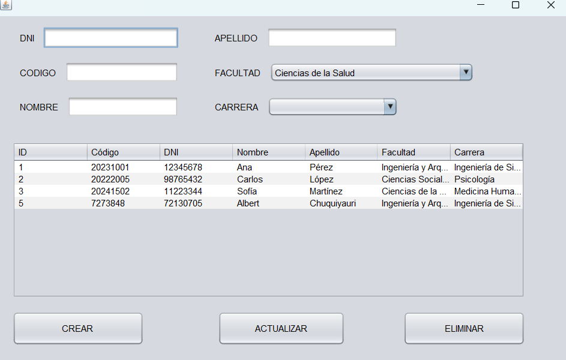

# 🌟 **Sistema de Gestión de Carnets Universitarios** 🌟

<p align="center">
  
</p>

---

## 🏫 **Universidad Peruana Los Andes**
### 👨‍🎓 **Facultad de Ingeniería de Sistemas**  
### 👩‍🏫 **Escuela Profesional de Ingeniería de Sistemas e Informática**

---

## ✨ **Información del Proyecto**

**Realizado por:**  
[Chuquiyauri Lagunas Albert Jeankarlo]  

**Asignatura:**  
Taller VI Aplicaciones  

**Docente a Cargo:**  
[Mg. Fernandez Bejarano Raul]  

**Año Académico:**  
2025

---

# 🎓 Sistema de Gestión de Carnets Universitarios

Este proyecto es una aplicación de escritorio en Java Swing que permite **gestionar carnets universitarios**. Se construyó siguiendo el patrón de diseño **MVC (Modelo - Vista - Controlador)**, y permite realizar operaciones básicas de **crear, listar, actualizar y eliminar** carnets, así como vincularlos a una **facultad y carrera profesional**.

---

## 📷 Capturas de Pantalla

### Interfaz principal:



### Componentes del formulario:


---

## 🧠 Objetivo del Proyecto

El sistema busca facilitar la administración de carnets universitarios, con una interfaz simple que interactúa con una base de datos MySQL. Cada carnet se relaciona con una **facultad** y una **carrera profesional**, cumpliendo las siguientes reglas:

- Una **facultad** puede tener muchas **carreras profesionales**.
- Una **carrera profesional** pertenece a **una sola facultad**.

---

## 🧱 Arquitectura MVC

Este proyecto fue dividido en tres capas:

### 📄 Modelo (`modelo`)

Contiene las clases que representan las entidades:

- `Carnet.java`: Modelo de los estudiantes.
- `Facultad.java`: Modelo para facultades.
- `Carrera.java`: Modelo para carreras profesionales.
- `ConexionBD.java`: Encapsula la conexión a la base de datos.

### ⚙️ Controlador (`controlador`)

Lógica de negocio y consultas SQL:

- `ControladorCarnet.java`: Contiene métodos para registrar, actualizar, eliminar y listar carnets, así como cargar facultades y carreras.

### 🎨 Vista (`vista`)

Formulario Swing ya diseñado gráficamente (NetBeans, etc.):

- `Inicio.java`: Pantalla principal con tabla, campos de entrada, combo box, y botones para CRUD.

---

## 🗃️ Base de Datos (MySQL)

````sql
CREATE TABLE IF NOT EXISTS facultades (
    id_facultad INT AUTO_INCREMENT PRIMARY KEY,
    nombre_facultad VARCHAR(100) NOT NULL UNIQUE
);

CREATE TABLE IF NOT EXISTS carreras (
    id_carrera INT AUTO_INCREMENT PRIMARY KEY,
    nombre_carrera VARCHAR(100) NOT NULL UNIQUE,
    id_facultad INT NOT NULL,
    FOREIGN KEY (id_facultad) REFERENCES facultades(id_facultad)
);

CREATE TABLE IF NOT EXISTS estudiantes (
    id_estudiante INT AUTO_INCREMENT PRIMARY KEY,
    codigo VARCHAR(50) NOT NULL UNIQUE,
    dni VARCHAR(8) UNIQUE,
    apellidos VARCHAR(100) NOT NULL,
    nombres VARCHAR(100) NOT NULL,
    id_carrera INT NOT NULL,
    FOREIGN KEY (id_carrera) REFERENCES carreras(id_carrera)
);

## 🔧 Funcionalidades

- ✅ Crear nuevo carnet con datos como DNI, nombres, apellidos, código, facultad y carrera.
- ✅ Actualizar información de un carnet seleccionado desde la tabla.
- ✅ Eliminar carnet existente previa confirmación.
- ✅ Listar todos los carnets con su información completa en una tabla.
- ✅ Cargar dinámicamente la lista de **facultades** desde la base de datos.
- ✅ Mostrar solo las **carreras** que pertenecen a la **facultad seleccionada**.
- ✅ Validación de campos vacíos antes de registrar o actualizar.

---

## ⚙️ Ejecución del Proyecto

1. Asegúrate de tener **MySQL** funcionando y una base de datos llamada `carnet`.
2. Ejecuta los scripts SQL para crear las tablas `facultades`, `carreras`, y `estudiantes`.
3. Llena las tablas de facultades y carreras con datos de prueba.
4. Modifica `ConexionBD.java` con tu configuración local:

   ```java
   private static final String URL = "jdbc:mysql://localhost:3306/carnet";
   private static final String USER = "root";
   private static final String PASSWORD = "root123";

## ⚙️ Ejecución del Proyecto

1. **Base de Datos**:
   - Asegúrate de tener **MySQL** funcionando y una base de datos llamada `carnet`.
   - Ejecuta los siguientes scripts SQL para crear las tablas necesarias:

     ```sql
     CREATE TABLE IF NOT EXISTS facultades (
         id_facultad INT AUTO_INCREMENT PRIMARY KEY,
         nombre_facultad VARCHAR(100) NOT NULL UNIQUE
     );

     CREATE TABLE IF NOT EXISTS carreras (
         id_carrera INT AUTO_INCREMENT PRIMARY KEY,
         nombre_carrera VARCHAR(100) NOT NULL UNIQUE,
         id_facultad INT NOT NULL,
         FOREIGN KEY (id_facultad) REFERENCES facultades(id_facultad)
     );

     CREATE TABLE IF NOT EXISTS estudiantes (
         id_estudiante INT AUTO_INCREMENT PRIMARY KEY,
         codigo VARCHAR(50) NOT NULL UNIQUE,
         dni VARCHAR(8) UNIQUE,
         apellidos VARCHAR(100) NOT NULL,
         nombres VARCHAR(100) NOT NULL,
         id_carrera INT NOT NULL,
         FOREIGN KEY (id_carrera) REFERENCES carreras(id_carrera)
     );
     ```

   - Llena las tablas de **facultades** y **carreras** con datos de prueba.

2. **Configuración de la Conexión a la Base de Datos**:
   - Abre el archivo `ConexionBD.java` y modifica los siguientes parámetros con tus credenciales de MySQL locales:

     ```java
     private static final String URL = "jdbc:mysql://localhost:3306/carnet";
     private static final String USER = "root";
     private static final String PASSWORD = "root123";  // Cambia por tu contraseña real
     ```

3. **Abrir en NetBeans (o tu IDE preferido)**:
   - Si estás usando **NetBeans**:
     - Abre **NetBeans** y selecciona **File → Open Project**.
     - Navega a la carpeta de tu proyecto y selecciona el directorio principal donde está el archivo `.java` principal.
   - Si usas otro IDE, simplemente abre el proyecto normalmente.

4. **Ejecución del Proyecto**:
   - En NetBeans, haz clic derecho sobre el archivo `Inicio.java` (o el archivo principal que contiene la función `main`) y selecciona **Run**.
   - El formulario debería abrirse y podrás interactuar con la base de datos para agregar, actualizar, eliminar y listar los carnets universitarios.

---

## 🔎 Explicación de Código Clave

### `ControladorCarnet.java`

- **`listarCarnets(JTable tabla)`**: Este método consulta la base de datos para obtener los carnets existentes y los carga en la tabla con información adicional sobre la carrera y la facultad.
- **`registrarCarnet(Carnet carnet)`**: Inserta un nuevo carnet en la base de datos, utilizando los datos proporcionados en el formulario.
- **`actualizarCarnet(Carnet carnet)`**: Permite modificar un carnet ya registrado en la base de datos mediante su ID.
- **`eliminarCarnet(int id)`**: Elimina un carnet específico de la base de datos utilizando su ID.
- **`obtenerFacultades()`**: Recupera todas las facultades desde la base de datos.
- **`obtenerCarrerasPorFacultad(int idFacultad)`**: Recupera todas las carreras asociadas a una facultad específica desde la base de datos.

---

## 🧠 ¿Por qué se creó este proyecto?

Este proyecto se desarrolló como parte de una práctica de programación con Java y MySQL, con los siguientes objetivos:

- Aplicar el patrón de diseño **MVC (Modelo - Vista - Controlador)** en una aplicación real.
- Integrar **Java Swing** con **MySQL** utilizando **JDBC** para la manipulación de datos.
- Desarrollar un sistema de gestión de carnets universitarios.
- Crear una interfaz de usuario simple y funcional para interactuar con la base de datos de forma eficiente.

---

## 👤 Autor

- **Nombre del Autor**: [Chuquiyauri Lagunas Albert]
- **Correo Electrónico**: [p00904j@upla.edu.pe]
- **Año de Creación**: 2025

---

## 📜 Licencia

Este proyecto es de libre uso y distribución bajo fines educativos y académicos.
````
## 📜 codigo del jFrame
```java
/*
 * Click nbfs://nbhost/SystemFileSystem/Templates/Licenses/license-default.txt to change this license
 * Click nbfs://nbhost/SystemFileSystem/Templates/GUIForms/JFrame.java to edit this template
 */
package Vista;

import controlador.ControladorCarnet;
import java.util.List;
import javax.swing.DefaultComboBoxModel;
import javax.swing.JOptionPane;
import modelo.Carnet;
import modelo.Carrera;
import modelo.Facultad;
import javax.swing.DefaultComboBoxModel;

/**
 *
 * @author adria
 */
public class Inicio extends javax.swing.JFrame {

    /**
     * Creates new form Inicio
     */
    private ControladorCarnet controlador;

    public Inicio() {
        initComponents();

        controlador = new ControladorCarnet(); // Inicializas el controlador

        cargarFacultades(); // Llenar combo de facultades
        controlador.listarCarnets(tblCarnet); // Llenar la tabla de carnets

        // Agregas listener al ComboBox de facultades
        cmbFacultad.addActionListener(e -> {
            Facultad facultadSeleccionada = (Facultad) cmbFacultad.getSelectedItem();
            if (facultadSeleccionada != null) {
                cargarCarreras(facultadSeleccionada.getId());
            }
        });
    }

    private void cargarCarreras(int idFacultad) {
        List<Carrera> carreras = controlador.obtenerCarrerasPorFacultad(idFacultad);

        DefaultComboBoxModel<Carrera> carreraModel = new DefaultComboBoxModel<>(); // ← ESTA ES LA VARIABLE

        for (Carrera c : carreras) {
            carreraModel.addElement(c); // ← AQUÍ LA USAS
        }

        cmbCarrera.setModel(carreraModel); // ← SE ASIGNA AL COMBOBOX
    }

    private void cargarFacultades() {
        List<Facultad> facultades = controlador.obtenerFacultades();
        DefaultComboBoxModel<Facultad> facultadModel = new DefaultComboBoxModel<>();

        for (Facultad f : facultades) {
            facultadModel.addElement(f);
        }

        cmbFacultad.setModel(facultadModel);
    }

    /**
     * This method is called from within the constructor to initialize the form.
     * WARNING: Do NOT modify this code. The content of this method is always
     * regenerated by the Form Editor.
     */
    @SuppressWarnings("unchecked")
    // <editor-fold defaultstate="collapsed" desc="Generated Code">                          
    private void initComponents() {

        btnCrear = new javax.swing.JButton();
        btnActualizar = new javax.swing.JButton();
        btnEliminar = new javax.swing.JButton();
        jScrollPane1 = new javax.swing.JScrollPane();
        tblCarnet = new javax.swing.JTable();
        jLabel1 = new javax.swing.JLabel();
        txtDni = new javax.swing.JTextField();
        jLabel2 = new javax.swing.JLabel();
        txtCodigo = new javax.swing.JTextField();
        jLabel3 = new javax.swing.JLabel();
        txtNombre = new javax.swing.JTextField();
        txtApellido = new javax.swing.JTextField();
        jLabel4 = new javax.swing.JLabel();
        jLabel5 = new javax.swing.JLabel();
        jLabel6 = new javax.swing.JLabel();
        cmbFacultad = new javax.swing.JComboBox<>();
        cmbCarrera = new javax.swing.JComboBox<>();

        setDefaultCloseOperation(javax.swing.WindowConstants.EXIT_ON_CLOSE);

        btnCrear.setText("CREAR");
        btnCrear.addActionListener(new java.awt.event.ActionListener() {
            public void actionPerformed(java.awt.event.ActionEvent evt) {
                btnCrearActionPerformed(evt);
            }
        });

        btnActualizar.setText("ACTUALIZAR");

        btnEliminar.setText("ELIMINAR");
        btnEliminar.addActionListener(new java.awt.event.ActionListener() {
            public void actionPerformed(java.awt.event.ActionEvent evt) {
                btnEliminarActionPerformed(evt);
            }
        });

        tblCarnet.setModel(new javax.swing.table.DefaultTableModel(
            new Object [][] {
                {null, null, null, null},
                {null, null, null, null},
                {null, null, null, null},
                {null, null, null, null}
            },
            new String [] {
                "Title 1", "Title 2", "Title 3", "Title 4"
            }
        ));
        jScrollPane1.setViewportView(tblCarnet);

        jLabel1.setText("DNI");

        jLabel2.setText("CODIGO");

        jLabel3.setText("NOMBRE");

        jLabel4.setText("APELLIDO");

        jLabel5.setText("FACULTAD");

        jLabel6.setText("CARRERA");

        javax.swing.GroupLayout layout = new javax.swing.GroupLayout(getContentPane());
        getContentPane().setLayout(layout);
        layout.setHorizontalGroup(
            layout.createParallelGroup(javax.swing.GroupLayout.Alignment.LEADING)
            .addGroup(layout.createSequentialGroup()
                .addGap(34, 34, 34)
                .addGroup(layout.createParallelGroup(javax.swing.GroupLayout.Alignment.LEADING, false)
                    .addGroup(layout.createSequentialGroup()
                        .addComponent(jLabel1)
                        .addPreferredGap(javax.swing.LayoutStyle.ComponentPlacement.UNRELATED)
                        .addComponent(txtDni))
                    .addGroup(layout.createSequentialGroup()
                        .addComponent(jLabel2)
                        .addPreferredGap(javax.swing.LayoutStyle.ComponentPlacement.UNRELATED)
                        .addComponent(txtCodigo))
                    .addGroup(layout.createSequentialGroup()
                        .addComponent(jLabel3)
                        .addPreferredGap(javax.swing.LayoutStyle.ComponentPlacement.UNRELATED)
                        .addComponent(txtNombre, javax.swing.GroupLayout.PREFERRED_SIZE, 148, javax.swing.GroupLayout.PREFERRED_SIZE)))
                .addPreferredGap(javax.swing.LayoutStyle.ComponentPlacement.RELATED, javax.swing.GroupLayout.DEFAULT_SIZE, Short.MAX_VALUE)
                .addGroup(layout.createParallelGroup(javax.swing.GroupLayout.Alignment.LEADING, false)
                    .addGroup(layout.createSequentialGroup()
                        .addComponent(jLabel6)
                        .addPreferredGap(javax.swing.LayoutStyle.ComponentPlacement.UNRELATED)
                        .addComponent(cmbCarrera, javax.swing.GroupLayout.PREFERRED_SIZE, 174, javax.swing.GroupLayout.PREFERRED_SIZE))
                    .addGroup(layout.createSequentialGroup()
                        .addComponent(jLabel5)
                        .addPreferredGap(javax.swing.LayoutStyle.ComponentPlacement.UNRELATED)
                        .addComponent(cmbFacultad, 0, javax.swing.GroupLayout.DEFAULT_SIZE, Short.MAX_VALUE))
                    .addGroup(layout.createSequentialGroup()
                        .addComponent(jLabel4)
                        .addPreferredGap(javax.swing.LayoutStyle.ComponentPlacement.UNRELATED)
                        .addComponent(txtApellido, javax.swing.GroupLayout.PREFERRED_SIZE, 174, javax.swing.GroupLayout.PREFERRED_SIZE)))
                .addGap(127, 127, 127))
            .addGroup(layout.createSequentialGroup()
                .addGap(24, 24, 24)
                .addGroup(layout.createParallelGroup(javax.swing.GroupLayout.Alignment.LEADING, false)
                    .addGroup(layout.createSequentialGroup()
                        .addComponent(btnCrear, javax.swing.GroupLayout.PREFERRED_SIZE, 175, javax.swing.GroupLayout.PREFERRED_SIZE)
                        .addPreferredGap(javax.swing.LayoutStyle.ComponentPlacement.RELATED, javax.swing.GroupLayout.DEFAULT_SIZE, Short.MAX_VALUE)
                        .addComponent(btnActualizar, javax.swing.GroupLayout.PREFERRED_SIZE, 169, javax.swing.GroupLayout.PREFERRED_SIZE)
                        .addGap(78, 78, 78)
                        .addComponent(btnEliminar, javax.swing.GroupLayout.PREFERRED_SIZE, 162, javax.swing.GroupLayout.PREFERRED_SIZE))
                    .addComponent(jScrollPane1, javax.swing.GroupLayout.PREFERRED_SIZE, 683, javax.swing.GroupLayout.PREFERRED_SIZE))
                .addGap(0, 59, Short.MAX_VALUE))
        );
        layout.setVerticalGroup(
            layout.createParallelGroup(javax.swing.GroupLayout.Alignment.LEADING)
            .addGroup(javax.swing.GroupLayout.Alignment.TRAILING, layout.createSequentialGroup()
                .addGap(15, 15, 15)
                .addGroup(layout.createParallelGroup(javax.swing.GroupLayout.Alignment.BASELINE)
                    .addComponent(jLabel1)
                    .addComponent(txtDni, javax.swing.GroupLayout.PREFERRED_SIZE, javax.swing.GroupLayout.DEFAULT_SIZE, javax.swing.GroupLayout.PREFERRED_SIZE)
                    .addComponent(jLabel4)
                    .addComponent(txtApellido, javax.swing.GroupLayout.PREFERRED_SIZE, javax.swing.GroupLayout.DEFAULT_SIZE, javax.swing.GroupLayout.PREFERRED_SIZE))
                .addGap(18, 18, 18)
                .addGroup(layout.createParallelGroup(javax.swing.GroupLayout.Alignment.BASELINE)
                    .addComponent(jLabel2)
                    .addComponent(txtCodigo, javax.swing.GroupLayout.PREFERRED_SIZE, javax.swing.GroupLayout.DEFAULT_SIZE, javax.swing.GroupLayout.PREFERRED_SIZE)
                    .addComponent(jLabel5)
                    .addComponent(cmbFacultad, javax.swing.GroupLayout.PREFERRED_SIZE, javax.swing.GroupLayout.DEFAULT_SIZE, javax.swing.GroupLayout.PREFERRED_SIZE))
                .addGap(18, 18, 18)
                .addGroup(layout.createParallelGroup(javax.swing.GroupLayout.Alignment.BASELINE)
                    .addComponent(jLabel3)
                    .addComponent(txtNombre, javax.swing.GroupLayout.PREFERRED_SIZE, javax.swing.GroupLayout.DEFAULT_SIZE, javax.swing.GroupLayout.PREFERRED_SIZE)
                    .addComponent(jLabel6)
                    .addComponent(cmbCarrera, javax.swing.GroupLayout.PREFERRED_SIZE, javax.swing.GroupLayout.DEFAULT_SIZE, javax.swing.GroupLayout.PREFERRED_SIZE))
                .addGap(33, 33, 33)
                .addComponent(jScrollPane1, javax.swing.GroupLayout.PREFERRED_SIZE, 208, javax.swing.GroupLayout.PREFERRED_SIZE)
                .addGap(18, 18, 18)
                .addGroup(layout.createParallelGroup(javax.swing.GroupLayout.Alignment.BASELINE)
                    .addComponent(btnCrear, javax.swing.GroupLayout.PREFERRED_SIZE, 45, javax.swing.GroupLayout.PREFERRED_SIZE)
                    .addComponent(btnActualizar, javax.swing.GroupLayout.PREFERRED_SIZE, 45, javax.swing.GroupLayout.PREFERRED_SIZE)
                    .addComponent(btnEliminar, javax.swing.GroupLayout.PREFERRED_SIZE, 45, javax.swing.GroupLayout.PREFERRED_SIZE))
                .addContainerGap(30, Short.MAX_VALUE))
        );

        pack();
    }// </editor-fold>                        

    private void btnCrearActionPerformed(java.awt.event.ActionEvent evt) {                                         
        String codigo = txtCodigo.getText();
        String dni = txtDni.getText();
        String nombres = txtNombre.getText();
        String apellidos = txtApellido.getText();
        Facultad facultad = (Facultad) cmbFacultad.getSelectedItem();
        Carrera carrera = (Carrera) cmbCarrera.getSelectedItem();

        if (codigo.isEmpty() || dni.isEmpty() || nombres.isEmpty() || apellidos.isEmpty() || facultad == null || carrera == null) {
            JOptionPane.showMessageDialog(null, "Por favor complete todos los campos.");
        } else {
            // Crear objeto Carnet
            Carnet carnet = new Carnet(0, codigo, dni, nombres, apellidos, carrera.getId());

            // Llamar al controlador para crear el carnet en la base de datos
            controlador.registrarCarnet(carnet);

            // Actualizar la tabla después de agregar el carnet
            controlador.listarCarnets(tblCarnet);
        }
    }                                        

    private void btnEliminarActionPerformed(java.awt.event.ActionEvent evt) {                                            
        int selectedRow = tblCarnet.getSelectedRow();
        if (selectedRow != -1) {
            int id = (int) tblCarnet.getValueAt(selectedRow, 0);
            int confirm = JOptionPane.showConfirmDialog(null, "¿Estás seguro de eliminar este carnet?", "Confirmar eliminación", JOptionPane.YES_NO_OPTION);
            if (confirm == JOptionPane.YES_OPTION) {
                // Eliminar el carnet desde el controlador
                controlador.eliminarCarnet(id);
                // Actualizar la tabla
                controlador.listarCarnets(tblCarnet);
            }
        } else {
            JOptionPane.showMessageDialog(null, "Por favor selecciona un carnet para eliminar.");
        }
    }                                           

    /**
     * @param args the command line arguments
     */
    public static void main(String args[]) {
        /* Set the Nimbus look and feel */
        //<editor-fold defaultstate="collapsed" desc=" Look and feel setting code (optional) ">
        /* If Nimbus (introduced in Java SE 6) is not available, stay with the default look and feel.
         * For details see http://download.oracle.com/javase/tutorial/uiswing/lookandfeel/plaf.html 
         */
        try {
            for (javax.swing.UIManager.LookAndFeelInfo info : javax.swing.UIManager.getInstalledLookAndFeels()) {
                if ("Nimbus".equals(info.getName())) {
                    javax.swing.UIManager.setLookAndFeel(info.getClassName());
                    break;
                }
            }
        } catch (ClassNotFoundException ex) {
            java.util.logging.Logger.getLogger(Inicio.class.getName()).log(java.util.logging.Level.SEVERE, null, ex);
        } catch (InstantiationException ex) {
            java.util.logging.Logger.getLogger(Inicio.class.getName()).log(java.util.logging.Level.SEVERE, null, ex);
        } catch (IllegalAccessException ex) {
            java.util.logging.Logger.getLogger(Inicio.class.getName()).log(java.util.logging.Level.SEVERE, null, ex);
        } catch (javax.swing.UnsupportedLookAndFeelException ex) {
            java.util.logging.Logger.getLogger(Inicio.class.getName()).log(java.util.logging.Level.SEVERE, null, ex);
        }
        //</editor-fold>

        /* Create and display the form */
        java.awt.EventQueue.invokeLater(new Runnable() {
            public void run() {
                new Inicio().setVisible(true);
            }
        });
    }

    // Variables declaration - do not modify                     
    private javax.swing.JButton btnActualizar;
    private javax.swing.JButton btnCrear;
    private javax.swing.JButton btnEliminar;
    private javax.swing.JComboBox<Carrera> cmbCarrera;
    private javax.swing.JComboBox<Facultad> cmbFacultad;
    private javax.swing.JLabel jLabel1;
    private javax.swing.JLabel jLabel2;
    private javax.swing.JLabel jLabel3;
    private javax.swing.JLabel jLabel4;
    private javax.swing.JLabel jLabel5;
    private javax.swing.JLabel jLabel6;
    private javax.swing.JScrollPane jScrollPane1;
    private javax.swing.JTable tblCarnet;
    private javax.swing.JTextField txtApellido;
    private javax.swing.JTextField txtCodigo;
    private javax.swing.JTextField txtDni;
    private javax.swing.JTextField txtNombre;
    // End of variables declaration                   
}
```
## 📜 codigo del controlador
```java
/*
 * Click nbfs://nbhost/SystemFileSystem/Templates/Licenses/license-default.txt to change this license
 * Click nbfs://nbhost/SystemFileSystem/Templates/Classes/Class.java to edit this template
 */
package controlador;

import modelo.*;
import java.sql.*;
import java.util.ArrayList;
import java.util.List;
import javax.swing.*;

import javax.swing.table.DefaultTableModel;

import java.sql.PreparedStatement;

import modelo.Carrera;

import java.sql.Connection;


public class ControladorCarnet {

    private Connection conn;

    public ControladorCarnet() {
        conn = ConexionBD.getConnection();
    }

    // Listar carnets
    public void listarCarnets(JTable tabla) {
        DefaultTableModel model = new DefaultTableModel();
        model.addColumn("ID");
        model.addColumn("Código");
        model.addColumn("DNI");
        model.addColumn("Nombre");
        model.addColumn("Apellido");
        model.addColumn("Facultad");
        model.addColumn("Carrera");

        String query = """
            SELECT e.id_estudiante, e.codigo, e.dni, e.nombres, e.apellidos, 
                   f.nombre_facultad, c.nombre_carrera
            FROM estudiantes e
            JOIN carreras c ON e.id_carrera = c.id_carrera
            JOIN facultades f ON c.id_facultad = f.id_facultad
        """;

        try (PreparedStatement stmt = conn.prepareStatement(query); ResultSet rs = stmt.executeQuery()) {

            while (rs.next()) {
                model.addRow(new Object[]{
                    rs.getInt("id_estudiante"),
                    rs.getString("codigo"),
                    rs.getString("dni"),
                    rs.getString("nombres"),
                    rs.getString("apellidos"),
                    rs.getString("nombre_facultad"),
                    rs.getString("nombre_carrera")
                });
            }
            tabla.setModel(model);

        } catch (SQLException e) {
            JOptionPane.showMessageDialog(null, "Error al listar: " + e.getMessage());
        }
    }

    // Registrar nuevo carnet
    public void registrarCarnet(Carnet carnet) {
        String sql = """
            INSERT INTO estudiantes (codigo, dni, nombres, apellidos, id_carrera)
            VALUES (?, ?, ?, ?, ?)
        """;

        try (PreparedStatement stmt = conn.prepareStatement(sql)) {
            stmt.setString(1, carnet.getCodigo());
            stmt.setString(2, carnet.getDni());
            stmt.setString(3, carnet.getNombres());
            stmt.setString(4, carnet.getApellidos());
            stmt.setInt(5, carnet.getIdCarrera());
            stmt.executeUpdate();
            JOptionPane.showMessageDialog(null, "Carnet registrado correctamente.");
        } catch (SQLException e) {
            JOptionPane.showMessageDialog(null, "Error al registrar: " + e.getMessage());
        }
    }

    // Actualizar carnet existente
    public void actualizarCarnet(Carnet carnet) {
        String sql = """
            UPDATE estudiantes
            SET codigo = ?, dni = ?, nombres = ?, apellidos = ?, id_carrera = ?
            WHERE id_estudiante = ?
        """;

        try (PreparedStatement stmt = conn.prepareStatement(sql)) {
            stmt.setString(1, carnet.getCodigo());
            stmt.setString(2, carnet.getDni());
            stmt.setString(3, carnet.getNombres());
            stmt.setString(4, carnet.getApellidos());
            stmt.setInt(5, carnet.getIdCarrera());
            stmt.setInt(6, carnet.getId());
            stmt.executeUpdate();
            JOptionPane.showMessageDialog(null, "Carnet actualizado correctamente.");
        } catch (SQLException e) {
            JOptionPane.showMessageDialog(null, "Error al actualizar: " + e.getMessage());
        }
    }

    // Eliminar carnet
    public void eliminarCarnet(int id) {
        String sql = "DELETE FROM estudiantes WHERE id_estudiante = ?";

        try (PreparedStatement stmt = conn.prepareStatement(sql)) {
            stmt.setInt(1, id);
            stmt.executeUpdate();
            JOptionPane.showMessageDialog(null, "Carnet eliminado correctamente.");
        } catch (SQLException e) {
            JOptionPane.showMessageDialog(null, "Error al eliminar: " + e.getMessage());
        }
    }

    // Cargar facultades
    public List<Facultad> obtenerFacultades() {
        List<Facultad> lista = new ArrayList<>();
        String sql = "SELECT * FROM facultades";

        try (PreparedStatement stmt = conn.prepareStatement(sql); ResultSet rs = stmt.executeQuery()) {

            while (rs.next()) {
                lista.add(new Facultad(
                        rs.getInt("id_facultad"),
                        rs.getString("nombre_facultad")
                ));
            }

        } catch (SQLException e) {
            JOptionPane.showMessageDialog(null, "Error cargando facultades: " + e.getMessage());
        }
        return lista;
    }

    // Cargar carreras por facultad
    public List<Carrera> obtenerCarrerasPorFacultad(int idFacultad) {
        List<Carrera> lista = new ArrayList<>();
        String sql = "SELECT * FROM carreras WHERE id_facultad = ?";

        try (PreparedStatement stmt = conn.prepareStatement(sql)) {
            stmt.setInt(1, idFacultad);
            ResultSet rs = stmt.executeQuery();
            while (rs.next()) {
                lista.add(new Carrera(
                        rs.getInt("id_carrera"),
                        rs.getString("nombre_carrera"),
                        rs.getInt("id_facultad")
                ));
            }
        } catch (SQLException e) {
            JOptionPane.showMessageDialog(null, "Error cargando carreras: " + e.getMessage());
        }
        return lista;
    }
}

```
## 📜 codigo del carnet
```java
/*
 * Click nbfs://nbhost/SystemFileSystem/Templates/Licenses/license-default.txt to change this license
 * Click nbfs://nbhost/SystemFileSystem/Templates/Classes/Class.java to edit this template
 */
package modelo;

public class Carnet {

    private int id;
    private String codigo;
    private String dni;
    private String nombres;
    private String apellidos;
    private int idCarrera;

    // Constructor
    public Carnet(int id, String codigo, String dni, String nombres, String apellidos, int idCarrera) {
        this.id = id;
        this.codigo = codigo;
        this.dni = dni;
        this.nombres = nombres;
        this.apellidos = apellidos;
        this.idCarrera = idCarrera;
    }

    public Carnet() {
    }

    // Getters y Setters
    public int getId() {
        return id;
    }

    public void setId(int id) {
        this.id = id;
    }

    public String getCodigo() {
        return codigo;
    }

    public void setCodigo(String codigo) {
        this.codigo = codigo;
    }

    public String getDni() {
        return dni;
    }

    public void setDni(String dni) {
        this.dni = dni;
    }

    public String getNombres() {
        return nombres;
    }

    public void setNombres(String nombres) {
        this.nombres = nombres;
    }

    public String getApellidos() {
        return apellidos;
    }

    public void setApellidos(String apellidos) {
        this.apellidos = apellidos;
    }

    public int getIdCarrera() {
        return idCarrera;
    }

    public void setIdCarrera(int idCarrera) {
        this.idCarrera = idCarrera;
    }
}

```
## 📜 codigo de la conexion de la base de datos
```java
/*
 * Click nbfs://nbhost/SystemFileSystem/Templates/Licenses/license-default.txt to change this license
 * Click nbfs://nbhost/SystemFileSystem/Templates/Classes/Class.java to edit this template
 */
package modelo;

public class Carnet {

    private int id;
    private String codigo;
    private String dni;
    private String nombres;
    private String apellidos;
    private int idCarrera;

    // Constructor
    public Carnet(int id, String codigo, String dni, String nombres, String apellidos, int idCarrera) {
        this.id = id;
        this.codigo = codigo;
        this.dni = dni;
        this.nombres = nombres;
        this.apellidos = apellidos;
        this.idCarrera = idCarrera;
    }

    public Carnet() {
    }

    // Getters y Setters
    public int getId() {
        return id;
    }

    public void setId(int id) {
        this.id = id;
    }

    public String getCodigo() {
        return codigo;
    }

    public void setCodigo(String codigo) {
        this.codigo = codigo;
    }

    public String getDni() {
        return dni;
    }

    public void setDni(String dni) {
        this.dni = dni;
    }

    public String getNombres() {
        return nombres;
    }

    public void setNombres(String nombres) {
        this.nombres = nombres;
    }

    public String getApellidos() {
        return apellidos;
    }

    public void setApellidos(String apellidos) {
        this.apellidos = apellidos;
    }

    public int getIdCarrera() {
        return idCarrera;
    }

    public void setIdCarrera(int idCarrera) {
        this.idCarrera = idCarrera;
    }
}

```
## 📜 codigo de la facutad
```java
/*
 * Click nbfs://nbhost/SystemFileSystem/Templates/Licenses/license-default.txt to change this license
 * Click nbfs://nbhost/SystemFileSystem/Templates/Classes/Class.java to edit this template
 */
package modelo;

public class Facultad {

    private int id;
    private String nombre;

    public Facultad() {
    }

    public Facultad(int id, String nombre) {
        this.id = id;
        this.nombre = nombre;
    }

    public int getId() {
        return id;
    }

    public void setId(int id) {
        this.id = id;
    }

    public String getNombre() {
        return nombre;
    }

    public void setNombre(String nombre) {
        this.nombre = nombre;
    }

    @Override
    public String toString() {
        return nombre; // Para mostrar en el JComboBox
    }
}
```
## 📜 codigo de la carrera
```java
/*
 * Click nbfs://nbhost/SystemFileSystem/Templates/Licenses/license-default.txt to change this license
 * Click nbfs://nbhost/SystemFileSystem/Templates/Classes/Class.java to edit this template
 */
package modelo;


public class Carrera {

    private int id;
    private String nombre;
    private int idFacultad;

    public Carrera() {
    }

    public Carrera(int id, String nombre, int idFacultad) {
        this.id = id;
        this.nombre = nombre;
        this.idFacultad = idFacultad;
    }

    public int getId() {
        return id;
    }

    public void setId(int id) {
        this.id = id;
    }

    public String getNombre() {
        return nombre;
    }

    public void setNombre(String nombre) {
        this.nombre = nombre;
    }

    public int getIdFacultad() {
        return idFacultad;
    }

    public void setIdFacultad(int idFacultad) {
        this.idFacultad = idFacultad;
    }

    @Override
    public String toString() {
        return nombre; // Para mostrar en el JComboBox
    }
}
```
## 📜 codigo del controlador
```java

```
